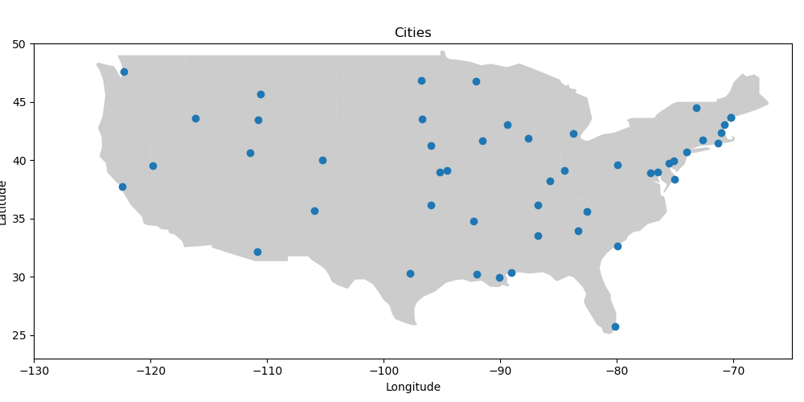
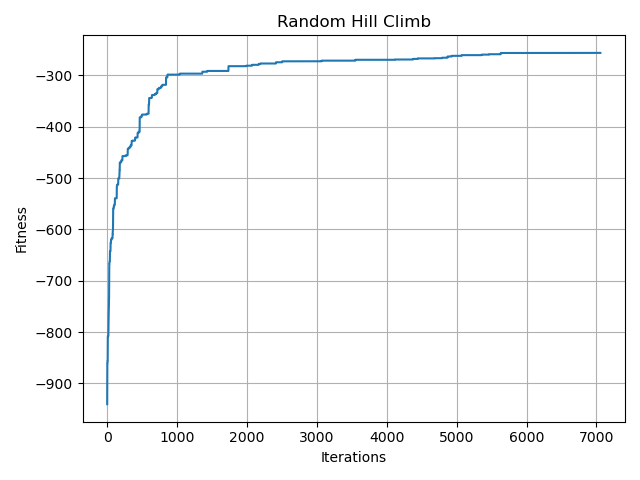
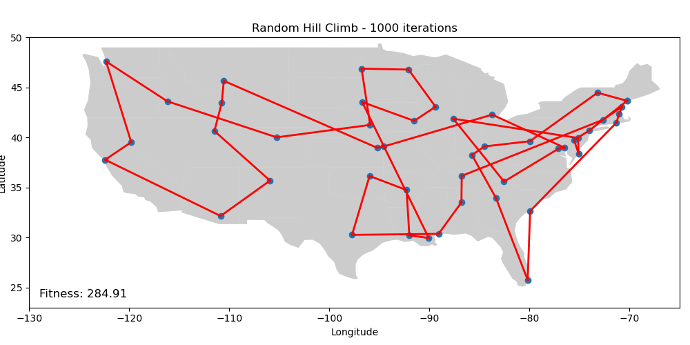
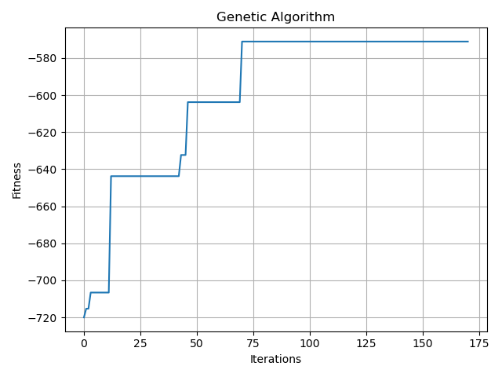
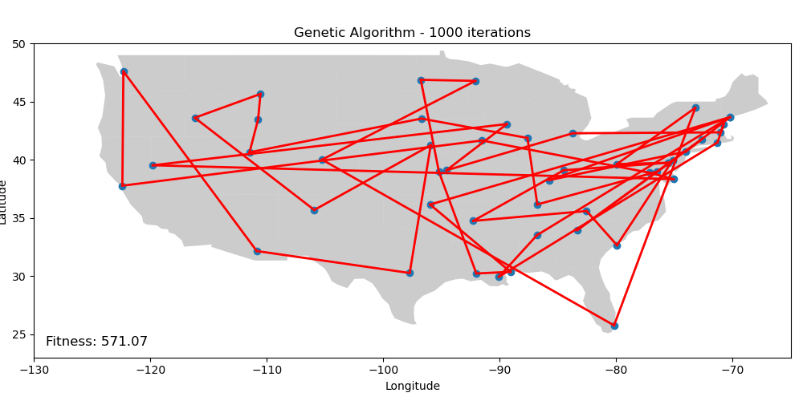
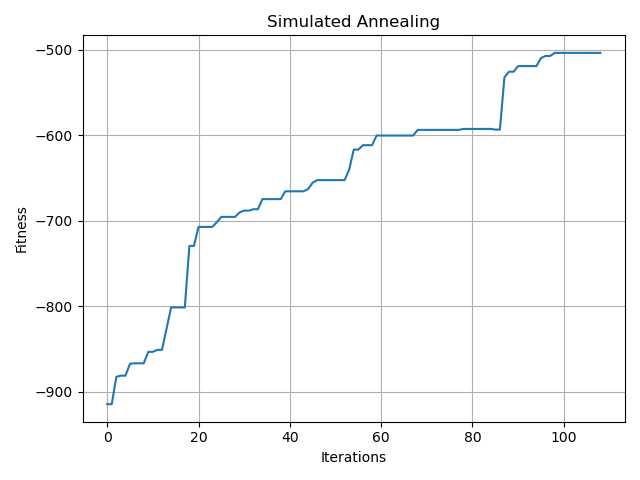
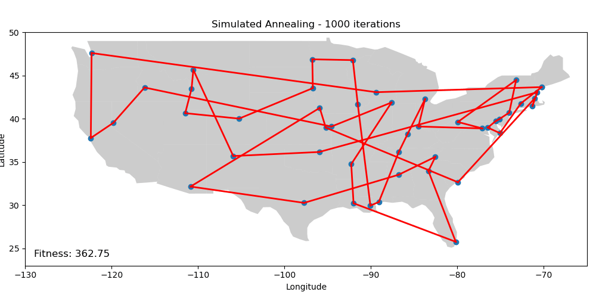

# Road Trip Optimizer

## Overview

The Road Trip Optimizer is an application designed to find the most efficient route for a road trip using machine learning algorithms. It leverages the MLrose library to implement Random Hill Climbing (RHC), Genetic Algorithm (GA), and Simulated Annealing (SA) to solve the Traveling Salesman Problem (TSP).

## Analysis

The goal of this project is to compare the performance of three different optimization algorithms on creating a road trip that vists 48 United States Cites in the shortest amount of time. The distances are calculated using the haversine formula and then changed to account for driving time. The data is then plotted on a map of the United States to visualize the path that the algorithms take. The algorithms are then compared based on the fitness of the solution and the time it takes to find the solution. The results are shown below.

The traveling salesmen problem is a classic NP-hard graph theory question that is concerned with the total
sum length of edges such that the program visits every node. Put another way, given N nodes, our optimization
problem is concerned with finding the most efficient path between these nodes, while making sure to visit each node
only once. The fitness function for the given optimization problem is minimizing the total edge length over the
graph. In this implementation, the nodes are integer values between 0 and n, represented on a cartesian plane.
According to a paper from Cornell University the traveling salesmen problem has numerous real-life applications,
such as drilling of printed circuit boards, job sequencing and computer wiring. Since there are so many local optima
within the traveling salesmen problem, we would expect something like simulated annealing to preform best due to
its tendency to first explore then to exploit. It will be interesting to see how algorithms deal with this challenging
landscape that the traveling salesmen problem presents

### Random Hill Climbing

### Genetic Algorithm

### Simulated Annealing

## Installation

This project is containerized using Docker, which encapsulates all dependencies and runs the application in an isolated environment. To get started, make sure you have Docker installed on your system. You can download and install Docker from [Docker's official website](https://www.docker.com/get-started).

Once Docker is set up, follow these steps to build and run the Road Trip Optimizer:

1. **Clone the repository:**
2. **Build the Docker image:**
3. **Run the application in a Docker container:**
4. **Install the Python dependencies:**
Inside the Docker container, you can install the required Python packages using the provided `requirements.txt` file:

## Acknowledgements

- <https://mlrose.readthedocs.io/en/stable/index.html>

- <https://datascientyst.com/plot-latitude-longitude-pandas-dataframe-python/>

- <https://www.naturalearthdata.com/downloads/>

- <https://medium.com/@ianforrest11/graphing-latitudes-and-longitudes-on-a-map-bf64d5fca391>
